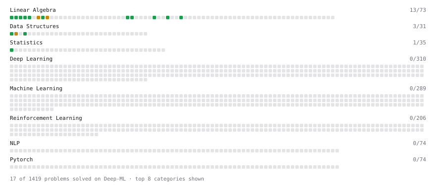

# Deep-ML

My machine learning practice from [Deep-ML](https://www.deep-ml.com). Every solution here was written by hand.

**21** solved · 15 problems · 0 labs · 6 math

[**Browse the interactive portfolio**](https://Zapryanovx.github.io/deep-ml/) to replay this filling in over time.

## Problems

| | Difficulty | Solved | |
| --- | --- | --- | --- |
| [Calculate 2x2 Matrix Inverse](https://www.deep-ml.com/problems/8) | easy | 2026-09-16 | [solution](problems/0008-calculate-2x2-matrix-inverse) |
| [Calculate Cosine Similarity Between Vectors](https://www.deep-ml.com/problems/76) | easy | 2026-09-16 | [solution](problems/0076-calculate-cosine-similarity-between-vectors) |
| [Calculate Covariance Matrix](https://www.deep-ml.com/problems/10) | easy | 2026-09-16 | [solution](problems/0010-calculate-covariance-matrix) |
| [Calculate Mean by Row or Column](https://www.deep-ml.com/problems/4) | easy | 2026-09-14 | [solution](problems/0004-calculate-mean-by-row-or-column) |
| [Check Linear Independence of Vectors](https://www.deep-ml.com/problems/331) | easy | 2026-09-16 | [solution](problems/0331-check-linear-independence-of-vectors) |
| [Dot Product Calculator](https://www.deep-ml.com/problems/83) | easy | 2026-09-16 | [solution](problems/0083-dot-product-calculator) |
| [Matrix-Vector Dot Product](https://www.deep-ml.com/problems/1) | easy | 2026-09-14 | [solution](problems/0001-matrix-vector-dot-product) |
| [Min-Max Scaling of Feature Values](https://www.deep-ml.com/problems/112) | easy | 2026-09-19 | [solution](problems/0112-min-max-scaling-of-feature-values) |
| [Reshape Matrix](https://www.deep-ml.com/problems/3) | easy | 2026-09-14 | [solution](problems/0003-reshape-matrix) |
| [Scalar Multiplication of a Matrix](https://www.deep-ml.com/problems/5) | easy | 2026-09-14 | [solution](problems/0005-scalar-multiplication-of-a-matrix) |
| [Transpose of a Matrix](https://www.deep-ml.com/problems/2) | easy | 2026-09-14 | [solution](problems/0002-transpose-of-a-matrix) |
| [Vector Element-wise Sum](https://www.deep-ml.com/problems/121) | easy | 2026-09-16 | [solution](problems/0121-vector-element-wise-sum) |
| [Vector Norms (L1/L2/L-inf) and the Frobenius Norm](https://www.deep-ml.com/problems/328) | easy | 2026-09-16 | [solution](problems/0328-vector-norms-l1-l2-l-inf-and-the-frobenius-norm) |
| [Matrix times Matrix ](https://www.deep-ml.com/problems/9) | medium | 2026-09-16 | [solution](problems/0009-matrix-times-matrix) |
| [Matrix Transformation ](https://www.deep-ml.com/problems/7) | medium | 2026-09-16 | [solution](problems/0007-matrix-transformation) |

## Math

| | Difficulty | Solved | |
| --- | --- | --- | --- |
| [Derivatives and Gradients](https://www.deep-ml.com/math-problems/1) | easy | 2026-09-16 | [solution](math/0001-derivatives-and-gradients) |
| [Gradient Descent Updates](https://www.deep-ml.com/math-problems/5) | easy | 2026-09-16 | [solution](math/0005-gradient-descent-updates) |
| [Matrix Basics](https://www.deep-ml.com/math-problems/9) | easy | 2026-09-16 | [solution](math/0009-matrix-basics) |
| [Vector Operations](https://www.deep-ml.com/math-problems/7) | easy | 2026-09-16 | [solution](math/0007-vector-operations) |
| [Matrix Multiplication](https://www.deep-ml.com/math-problems/10) | medium | 2026-09-16 | [solution](math/0010-matrix-multiplication) |
| [Vector Norms and Linear Independence](https://www.deep-ml.com/math-problems/8) | medium | 2026-09-16 | [solution](math/0008-vector-norms-and-linear-independence) |

---

_This file is regenerated by Deep-ML on every push._
